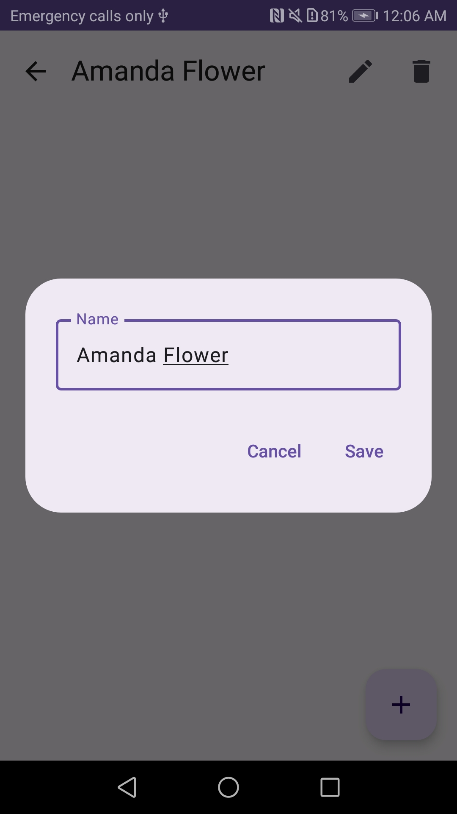
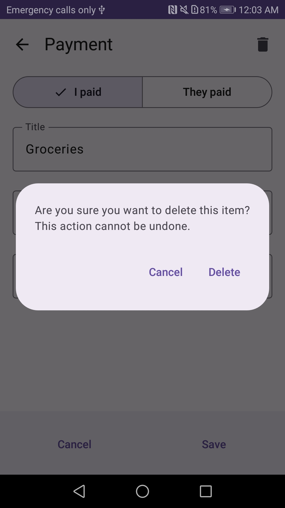

# PayMeBack Android App

PayMeBack is an Android app built in Kotlin that helps you track your expenses with friends. With PayMeBack, you can easily add people as records and keep track of your shared expenses. You can add payments to these records, specifying who paid, the title of the expense, the amount, and the date. The app also provides a clear view of your current balance with each person, making it convenient to settle up outstanding debts.

# Table of Contents

- [Features](#features)
- [Screenshots](#screenshots)
- [Usage](#usage)
- [Libraries Used](#libraries-used)

## Features

- User-friendly and intuitive UI powered by Jetpack Compose.
- Dependency injection handled by Hilt for clean and modular code.
- Local data storage using Room database for efficient management of records. Utilization of relations, triggers and migrations. 
- Keep track of expenses with multiple people and manage individual records.
- Sort your records using parameters stored in DataStore.
- Add payments to records with details of payer, title, amount, and date.
- Real-time balance calculation for each person to track outstanding debts easily.

## Screenshots

| Home Screen                               | Record                                     | Payment                                           |
|-------------------------------------------|--------------------------------------------|---------------------------------------------------|
|       |  |    |                                   |
|  |   |  |
## Usage

1. Launch the PayMeBack app on your Android device or emulator.
2. You will be presented with the home screen showing your existing records.
3. To add a new record, click the floating action button on your Home screen and provide the necessary details for the person.
4. Once you have added a record, you can click on it to view the record details.
5. In the record details screen, you can add payments by clicking the floating action button.
6. Enter the title, amount, and date of the payment, and select the person who made the payment.
7. The app will automatically update the balance between you and the selected person based on the new payment.
8. In the Home screen you can sort records by person's name, modification time or balance, descending or ascending.

## Libraries Used

- Jetpack Compose: Modern Android UI toolkit for building native UIs.
- Hilt: Dependency injection library for Android.
- Room: SQLite database library for offline data storage.
- DataStore: Android Jetpack library for asynchronous key-value pairs data storage.